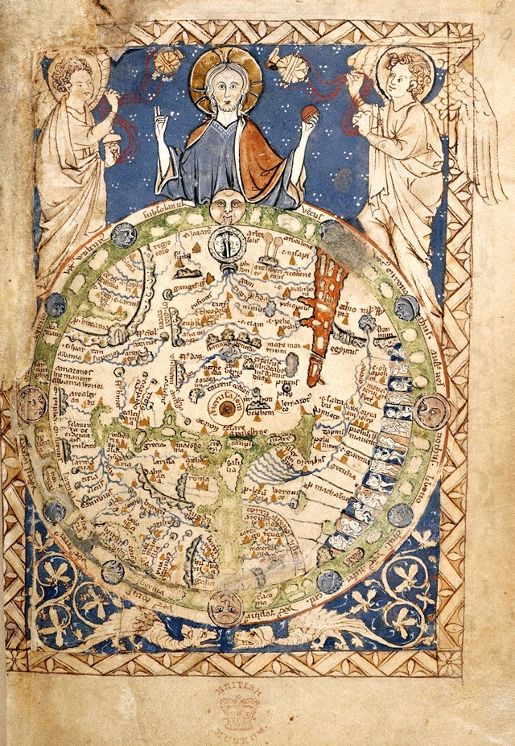

# Regnum Christi

## Un jeu médiéval, historique et fantastique

Ce jeu est pensé pour raconter autour d'une table, entre quelques joueurs, les péripétie de héros similaires à ceux des contes et légendes médiévaux. Il se situe dans notre moyen-âge, centré sur l’Europe chrétienne, le Royaume du Christ désigné par le titre. Il est prévu pour jouer un Moyen-Âge historique, de Charlemagne à la Guerre de Cent Ans, avec son lot de croisades et de cathédrales, tel que vu par les gens de cette époque, avec le fantastique qui s’impose.

## Documents

Ce document expose des règles de base pour le jeu, permettant d’y jouer rapidement. Sont aussi intéressants :

* [la feuille de personnage](https://docs.google.com/open?id=0B_CckUs46aGSblF2MHJpa2wtWWs)
* [un scénario dans le Gévaudan](https://docs.google.com/document/d/1XOmPMwdPxh93i9Uz1DimVHcO7uSmLE7K1iXmLJl5cDQ/edit)

## Inspirations

Jeux de rôle :

- [Ars Magica](http://www.atlas-games.com/arm5/)
- [Chronica Feudalis](http://chronicafeudalis.com/)
- [Miles Christi](http://www.legrog.org/jeux/miles-christi)
- [Fate](https://fate-srd.fr/wikifate/fatecore/start)

Livres :

- [La civilisation médiévale](http://imrryran.wordpress.com/2011/01/14/la-civilisation-medievale-de-jacques-le-goff/)
- [Héros et merveilles du Moyen Âge](http://imrryran.wordpress.com/2011/01/12/heros-et-merveilles-du-moyen-age-de-jacques-le-goff/)
- [Art &amp; Academe](http://imrryran.wordpress.com/2010/12/30/art-academe/)
- [Trois Christs](http://imrryran.wordpress.com/2011/10/02/trois-christs-de-valerie-mangin-denis-bajram-et-fabrice-neaud/)
- [Une histoire du diable](http://imrryran.wordpress.com/2011/06/21/une-histoire-du-diable-de-robert-muchembled/)

Articles :

- [sur mon blog](http://imrryran.wordpress.com/category/jeu-de-role/regnum-christi/)

## Lexique

Voici un lexique de base du jeu de rôle :

MJ
: Maître du Jeu, joueur particulier qui prépare des aventures pour les autres joueurs, maintient l'intérêt de la partie et veille au respect des règles

PNJ
: Personnage Non Joueur, personnage de l'aventure en question dirigé par le MJ

PJ
: Personnage Joueur, personnage de cette même aventure dirigé par un joueur non-MJ

D6
: dé à 6 faces, cubique et numéroté de 1 à 6

xp
: points d'eXPérience, donnés aux joueurs pour améliorer les statistiques de leur personnage après une partie
